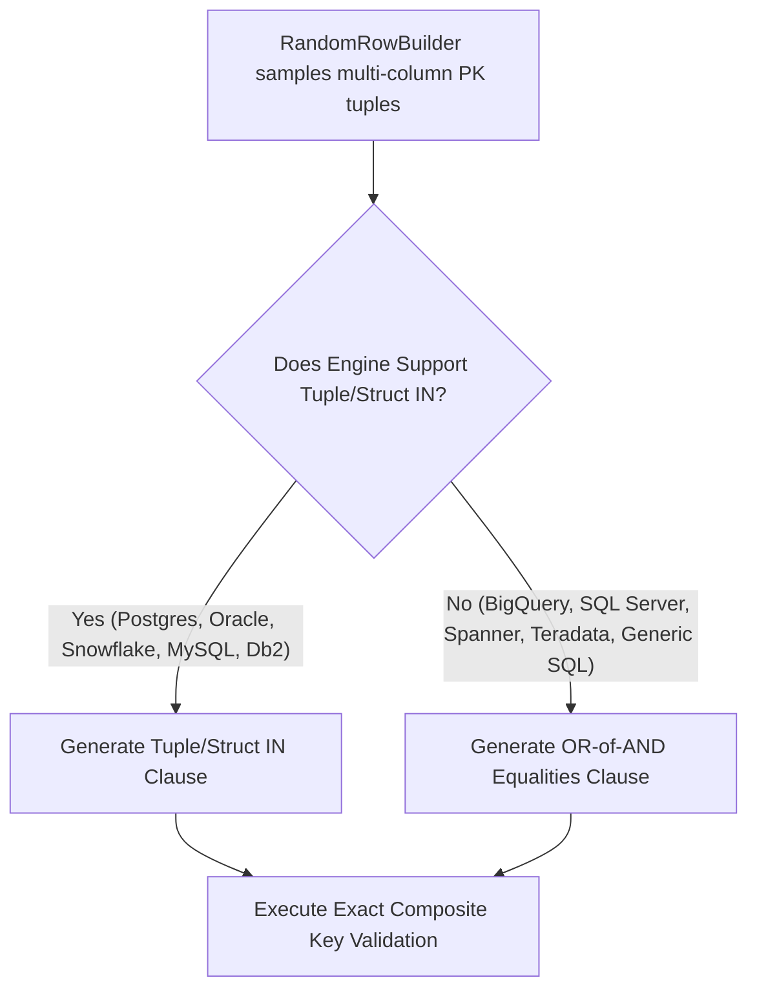

# Technical Design & Proposal: Composite Primary Key Random Row Sampling

## Executive Summary

This document presents a technical analysis and implementation plan to resolve [GitHub Issue #774](https://github.com/GoogleCloudPlatform/professional-services-data-validator/issues/774) in the Data Validation Tool (DVT).

Currently, when tables utilize composite primary keys (e.g. `(store_id, transaction_id, line_item_id)`), DVT's random row sampling mechanism **only uses the first primary key column** (`primary_keys[0]`). This leads to severe Cartesian over-fetching, degraded query performance, high database costs, and potential false failures.

This plan details the root cause, explores alternative architectural solutions, provides a database backend compatibility analysis, and outlines a recommended phased solution.

---

## 1. Current State & Problem Analysis

### 1.1 Current Implementation Flow

Random row sampling for row validation is triggered in [`data_validation/data_validation.py`](file://./data_validation/data_validation.py#L130-L237):

1. **First Primary Key Truncation**:
   In [`data_validation.py:L135-L146`](file://./data_validation/data_validation.py#L135-L146), DVT explicitly extracts only the first primary key column:
   ```python
   # Filter for only first primary key (multi-pk filter not supported)
   source_pk_column = self.config_manager.primary_keys[0][consts.CONFIG_SOURCE_COLUMN]
   target_pk_column = self.config_manager.primary_keys[0][consts.CONFIG_TARGET_COLUMN]

   randomRowBuilder = RandomRowBuilder(
       [source_pk_column],
       self.config_manager.random_row_batch_size(),
   )
   ```

2. **Querying Sampled Values**:
   [`RandomRowBuilder`](file://./data_validation/query_builder/random_row_builder.py#L43-L117) queries the source database for `batch_size` (e.g. 10,000) random values of `source_pk_column`.

3. **Applying `ISIN` Filter**:
   In [`data_validation.py:L228-L236`](file://./data_validation/data_validation.py#L228-L236), DVT creates a single `ISIN` filter:
   ```sql
   WHERE source_pk_col IN ('val1', 'val2', 'val3', ...)
   ```

### 1.2 Impact of Composite Primary Keys

When a table has composite primary keys such as `(store_id, transaction_id, line_item_id)`:

- **Low Cardinality Explosion**: The leading column (`store_id`) often has low cardinality relative to total table rows. Sampling 10,000 rows might yield only 5 distinct `store_id` values (e.g. `101`, `102`, `103`, `104`, `105`).
- **Cartesian Over-Fetching**: Filtering `WHERE store_id IN (101, 102, 103, 104, 105)` fetches **ALL** transactions and line items for those 5 stores—potentially millions of rows—instead of the requested 10,000 sampled rows.
- **False Failures & Performance Degradation**:
  - Memory consumption spikes or triggers Out-Of-Memory (OOM) errors during recursive row validation.
  - If query limit truncation occurs downstream without deterministic multi-column ordering, source and target queries return disjoint sub-rows, causing **false mismatch reports**.

---

## 2. Comprehensive Architectural Solutions

### Solution 1: Universal Disjunctive `OR` of `AND` Equalities (Recommended Primary Solution)

Construct an `OR` tree of exact row equality expressions:
```sql
WHERE (col1 = 'A' AND col2 = 1 AND col3 = 'X')
   OR (col1 = 'B' AND col2 = 2 AND col3 = 'Y')
   OR (col1 = 'C' AND col2 = 3 AND col3 = 'Z')
```

- **Pros**:
  - **100% Universal Compatibility**: Supported by every SQL dialect without exception (SQL Server, BigQuery, Oracle, Postgres, MySQL, Teradata, Spanner, Snowflake, DB2).
  - **Exact Matching**: Guarantees zero false failures and zero over-fetching; validates *only* the sampled tuples.
  - **Native Ibis Construction**: Can be generated using `FilterField.or_([FilterField.and_([...])])`.
- **Cons**:
  - SQL query string size grows linearly with batch size ($N \times \text{columns}$).
- **Mitigations**:
  - Automatically reduce default `random_row_batch_size` for composite key tables (e.g. 500–1,000 rows).
  - Split large IN-lists into sub-batches (similar to existing `get_max_in_list_size()` logic in [`validation_builder.py:L78`](file://./data_validation/validation_builder.py#L78)).

---

### Solution 2: Native Tuple / Row Constructor `IN` Clause

Construct native SQL tuple `IN` expressions:
```sql
WHERE (col1, col2, col3) IN (('A', 1, 'X'), ('B', 2, 'Y'), ('C', 3, 'Z'))
```
*(Or BigQuery STRUCT syntax: `WHERE STRUCT(col1, col2) IN (STRUCT('A', 1), ...)`)*

- **Pros**:
  - Concise SQL query string.
  - Exact tuple matching (zero false failures, zero over-fetching).
- **Cons & Database Compatibility**:
  - **Unsupported on SQL Server (T-SQL)**: T-SQL does not support tuple `IN` literals.
  - **Varied Syntax**: BigQuery uses `STRUCT` syntax, Spanner requires array `UNNEST`.

---

### Solution 3: Concatenated / Hashed Key Filter

Concatenate or hash composite key columns into a single virtual column:
```sql
WHERE CONCAT(CAST(col1 AS STRING), '||', CAST(col2 AS STRING)) IN ('A||1', 'B||2')
```

- **Pros**: Fits existing single-column `ISIN` filter structure.
- **Cons**:
  - **Invalidates Indexes**: Forces full table scans and per-row concatenation functions on both source and target databases.
  - Delimiter collision risks and dialect differences in `CONCAT` functions.

---

### Solution 4: CTE / Memory Table Join Strategy (Evaluated & Rejected)

Construct a Common Table Expression (CTE) containing the sampled primary key tuples and join the source/target table against it:

```sql
WITH sampled_pks AS (
  SELECT 'valA' AS col1, 100 AS col2
  UNION ALL
  SELECT 'valB' AS col1, 200 AS col2
)
SELECT target.*
FROM target_table target
INNER JOIN sampled_pks pks
  ON target.col1 = pks.col1 AND target.col2 = pks.col2
```
*(Or via `ibis.memtable(df)` / `semi_join` in Ibis).*

- **Pros**:
  - Eliminates deep boolean AST trees in `WHERE` clauses for very large batch sizes.
  - Allows database optimizers to execute hash joins or nested loop driving tables.
- **Cons & Rejection Rationale**:
  - **Severe Dialect Incompatibility for Inline Tables**: Inline constant table syntax varies dramatically across database engines (e.g., ANSI `WITH pks AS (VALUES ...)`, BigQuery `UNION ALL SELECT` or `UNNEST(STRUCT)`, Oracle `SELECT ... FROM DUAL UNION ALL`, SQL Server `VALUES` subquery, Spanner `UNNEST(STRUCT)`). Generating dialect-specific CTE inline tables across DVT's 15+ supported database backends requires extensive custom SQL generators.
  - **Architectural Mismatch with `ValidationBuilder`**: DVT's validation pipeline relies on `table.filter(boolean_expression)` (`WHERE` clause filter predicates). A CTE `JOIN` or `SEMI JOIN` requires mutating the core `ibis.Expr` table structure, breaking the clean predicate abstraction in `ValidationBuilder`.
  - **Optimizer & Index Impact**: Direct `WHERE` equality predicates allow optimizers on traditional RDBMS engines (Postgres, Oracle, SQL Server) to perform direct composite index seeks. Unindexed CTE joins may force temporary table materialization or full scans on unindexed CTE driver tables.

---

### Solution 5: Hybrid Engine-Aware Strategy (Best Architecture)

Combine **Solution 2 (Native Tuple IN)** for supported high-performance backends with **Solution 1 (Disjunctive OR-of-ANDs)** as a universal fallback:



---

## 3. Backend Database Compatibility Matrix

| Database Backend | Native Tuple `IN` (`(a,b) IN (...)`) | Struct `IN` | Disjunctive `OR-of-ANDs` | Recommended Strategy |
| :--- | :---: | :---: | :---: | :--- |
| **BigQuery** | Yes | Yes (`STRUCT(...) IN (...)`) | Yes | Native Tuple `IN` |
| **PostgreSQL** | Yes | N/A | Yes | Native Tuple `IN` |
| **MySQL / MariaDB** | Yes | N/A | Yes | Native Tuple `IN` |
| **Oracle** | Yes (max 1000 items) | N/A | Yes | Native Tuple `IN` |
| **Snowflake** | Yes | N/A | Yes | Native Tuple `IN` |
| **SQL Server (T-SQL)** | **No** | **No** | **Yes** | **Disjunctive `OR-of-ANDs`** |
| **Sybase** | **No** | **No** | **Yes** | **Disjunctive `OR-of-ANDs`** |
| **Google Cloud Spanner**| Yes | Limited | Yes | Native Tuple `IN` |
| **Teradata** | Limited | N/A | **Yes** | **Disjunctive `OR-of-ANDs`** |
| **IBM Db2** | Yes | N/A | **Yes** | Native Tuple `IN` |
| **Apache Hive** | **No** | **No** | **Yes** | **Disjunctive `OR-of-ANDs`** |
| **Apache Impala** | **No** | **No** | **Yes** | **Disjunctive `OR-of-ANDs`** |

### 3.1 Disjunctive `OR-of-ANDs` Recursion Depth Mitigation
When fallback strategies generate large numbers of conditions (e.g. `row_batch_size = 50`), passing them in a linear list to `ibis.or_()` causes the query string/AST parser (`sqlglot`) to recursively parse a deeply nested AST (a left- or right-heavy binary tree). This triggers Python's `RecursionError` on large sample sizes.
To mitigate this entirely, `FilterField.compile()` transforms sequences of `OR` and `AND` conditions into **balanced binary trees**. This reduces the AST depth for $N$ conditions from $O(N)$ down to $O(\log N)$, ensuring the compilation scales robustly to any batch size supported by the database engine's query text length limit.

> [!IMPORTANT]
> **Ibis Compiler vs. SQL Dialect Support**:
> Native tuple `(a, b) IN (...)` and struct `STRUCT(a, b) IN (...)` expressions are not natively compiled by Ibis across all backends out-of-the-box (e.g., BigQuery can raise `Unsupported type for BigQuery literal` if struct literals are not registered in the translator).
> Only set `dvt_tuple_in_supported() = True` on backends where **BOTH the database engine SQL dialect AND the Ibis backend compiler in DVT** natively compile tuple/struct literals without error. If Ibis compiler support is missing for a backend, `dvt_tuple_in_supported()` must default to `False`, safely routing to the universal `OR-of-ANDs` fallback.
>
> *Note on Method Naming (`dvt_tuple_in_supported`)*: We explicitly prefix custom DVT methods with `dvt_` (e.g. `dvt_tuple_in_supported`) to clearly distinguish DVT-specific capability extensions on backend classes from native upstream Ibis framework methods.

> [!NOTE]
> **Bind Parameters vs. SQL Literal Rendering**:
> - **Disjunctive `OR-of-ANDs`** (`ibis.or_([ibis.and_(...)])`): Uses native Ibis equality comparisons (`FilterField.equal_to()`), which SQLAlchemy natively compiles into **bind parameters** (`:param_1`, `:param_2`, etc.) on supported database drivers.
> - **Native Tuple `IN`** (`FilterField.tuple_in()`): Because Ibis lacks a native multi-column tuple `IN` AST node, DVT formats the tuples as a raw SQL string and compiles them via `operations.compile_raw_sql()` (`sa.text(...)`). Because `sa.text()` represents literal SQL text without a bound parameter dictionary, values in native tuple `IN` queries are rendered directly as **SQL literals** (`WHERE (a, b) IN ((1, 'X'), ...)`).
> - *Phase 2 Enhancement*: Extending `RawSQL` in `operations.py` to support parameterized execution (`sa.text(sql).bindparams(**params)`) or introducing a custom `TupleIn` AST operation with bind parameters can be evaluated as a Phase 2 enhancement.

---

## 4. Implementation Roadmap (Phased Approach)

### Phase 1: Enable Multi-Column Sampling in `RandomRowBuilder`
- In [`data_validation/data_validation.py`](file://./data_validation/data_validation.py#L143-L146), update `RandomRowBuilder` initialization to pass **all** source primary key columns:
  ```python
  source_pk_columns = [
      pk[consts.CONFIG_SOURCE_COLUMN] for pk in self.config_manager.primary_keys
  ]
  target_pk_columns = [
      pk[consts.CONFIG_TARGET_COLUMN] for pk in self.config_manager.primary_keys
  ]
  randomRowBuilder = RandomRowBuilder(
      source_pk_columns,
      self.config_manager.random_row_batch_size(),
  )
  ```
- Note: [`RandomRowBuilder`](file://./data_validation/query_builder/random_row_builder.py#L43) already accepts `List[str]` for `primary_keys` and executes `table[self.primary_keys]`, returning a pandas DataFrame with all primary key columns.

### Phase 2: Add Hybrid Engine-Aware `FilterField.composite_isin`

In [`data_validation/query_builder/query_builder.py`](file://./data_validation/query_builder/query_builder.py#L123), implement **Solution 4 (Hybrid Engine-Aware Strategy)** by:
1. Adding `@staticmethod def and_(field_list: list)` to `FilterField` and updating `compile()` to support recursive compilation for both `ibis.or_` and `ibis.and_`.
2. Adding a `dvt_tuple_in_supported() -> bool` method to each database backend (returning `True` for engines like PostgreSQL, MySQL, Oracle, Snowflake, and Db2, and `False` by default on SQL Server, Spanner, Teradata, and BigQuery).
3. Extending `FilterField` with `@staticmethod def composite_isin(...)` to check `client.dvt_tuple_in_supported()`:

```python
class FilterField(object):
    ...

    @staticmethod
    def and_(field_list: list):
        return FilterField(ibis.and_, left=field_list)

    @staticmethod
    def tuple_in(
        columns: List[str], tuples_list: List[tuple], backend_name: str
    ) -> "FilterField":
        """Build a native Tuple/Struct IN expression for supported engines."""
        return FilterField(
            "tuple_in", left=columns, right=tuples_list, left_field=backend_name
        )

    @staticmethod
    def composite_isin(
        client: "ibis.backends.base.BaseBackend",
        columns: List[str],
        values_df: pandas.DataFrame,
    ) -> "FilterField":
        """Build a hybrid composite key filter: native Tuple/Struct IN for supported engines,
        falling back to OR-of-ANDs for SQL Server, Spanner, and Teradata.
        """
        # 1. Native Tuple/Struct IN Path (High Performance)
        if hasattr(client, "dvt_tuple_in_supported") and client.dvt_tuple_in_supported():
            tuples_list = [tuple(x) for x in values_df[columns].to_numpy()]
            return FilterField.tuple_in(columns, tuples_list, client.name)

        # 2. Universal OR-of-ANDs Fallback Path (SQL Server, Spanner, Teradata)
        row_filters = []
        for row in values_df[columns].itertuples(index=False):
            eq_filters = [
                FilterField.equal_to(col_name, val)
                for col_name, val in zip(columns, row)
            ]
            row_filters.append(FilterField.and_(eq_filters))

        # Chunk OR-of-AND expressions into sub-batches to prevent AST depth/size limits
        max_batch_size = get_max_in_list_size(client) or 1000
        if len(row_filters) > max_batch_size:
            sub_batches = [
                FilterField.or_(sublist)
                for sublist in list_to_sublists(row_filters, max_batch_size)
            ]
            return FilterField.or_(sub_batches)
        else:
            return FilterField.or_(row_filters)

    def compile(self, ibis_table):
        if self.expr is None:
            return operations.compile_raw_sql(ibis_table, self.left)

        if self.left_field:
            self.left = ibis_table[self.left_field]

        if self.right_field:
            self.right = ibis_table[self.right_field]

        # Support both ibis.or_ and ibis.and_ multi-expression compilation
        if self.expr in (ibis.or_, ibis.and_):
            return self.expr(*[_.compile(ibis_table) for _ in self.left])
        elif self.expr == "tuple_in":
            return self._compile_tuple_in(ibis_table)
        else:
            return self.expr(self.left, self.right)
```

#### Example Usage & Compiled SQL Output

**Sampled Inputs** (`random_rows` DataFrame):
| store_id | transaction_id |
| :--- | :--- |
| `101` | `5001` |
| `102` | `5002` |

**Code Call**:
```python
filter_obj = FilterField.composite_isin(
    client, ["store_id", "transaction_id"], random_rows
)
compiled_ibis = filter_obj.compile(ibis_table)
```

**Compiled SQL Clauses Generated by Backend**:

- **Path 1: Supported Engines (`client.dvt_tuple_in_supported() == True`)**:

  - *PostgreSQL / MySQL / Oracle / Snowflake / Db2* (ANSI Tuple syntax):
    ```sql
    WHERE (store_id, transaction_id) IN ((101, 5001), (102, 5002))
    ```
- **Path 2: Universal Fallback (`bigquery`, `mssql`, `spanner`, `teradata`)**:
  ```sql
  WHERE (store_id = 101 AND transaction_id = 5001)
     OR (store_id = 102 AND transaction_id = 5002)
  ```
  *(Note: BigQuery uses Path 2 due to Ibis struct literal compilation limits, unless custom STRUCT literal rules are added).*

### Phase 3: Integration in `ValidationBuilder` & `data_validation.py`
- In `_add_random_row_filter()` ([`data_validation.py:L228`](file://./data_validation/data_validation.py#L228)), detect single vs composite primary keys.
- If single PK: retain existing optimized single-column `ISIN` filter path.
- If composite PK: apply `composite_isin` filter to source and target builders, ensuring that DataFrame columns are mapped from `source_pk_columns` to `target_pk_columns` when building the target filter.

#### 3.1 Critical Edge Cases: Multi-Column Binary, Padded Char, NULLs, & Column Mapping
Currently, [`data_validation.py:L163-L227`](file://./data_validation/data_validation.py#L163-L227) performs special formatting only for `primary_keys[0]`. When supporting composite primary keys, `_add_random_row_filter()` must loop across **all** primary key columns (`source_pk_columns` and `target_pk_columns`) to:
1. **Binary Primary Keys**:
   - For any column where `query[pk_col].type().is_binary()` is true, cast that column to `STRING` (hex) before executing the sample query:
     ```python
     query = query.mutate(**{pk_col: query[pk_col].cast("string")})
     ```
   - When building equality expressions for `FilterField.composite_isin()`, cast hex string literals back to binary: `ibis.literal(val).cast("binary")`.
2. **Oracle Padded String (`CHAR`) Columns**:
   - For any column where `is_padded_char(client, raw_types, pk_col)` is true, right-strip (`rstrip()`) in the query mutate step.
   - For Oracle source/target clients, left-justify (`ljust(char_length)`) string values per column so Oracle non-padded comparison semantics match correctly.
3. **Nullable Unique Keys**:
   - Although standard primary keys are `NOT NULL`, if a user-supplied unique key column contains `NULL` / `NaN`, SQL `col = NULL` evaluates to `UNKNOWN` (falsey). `FilterField.composite_isin()` should check `if pandas.isna(val)` and emit `col.isnull()` (`IS NULL`) for NULL values.
4. **Source vs. Target Column Name Differences**:
   - `RandomRowBuilder` queries only the source client, so the `random_rows` DataFrame is keyed by `source_pk_columns`.
   - When building `target_filter` for the target database, if `target_pk_columns` differs from `source_pk_columns` (e.g. `--primary-keys src_id=tgt_id`), passing `random_rows` directly will raise a DataFrame `KeyError` or generate invalid SQL.
   - `_add_random_row_filter()` must map `source_pk_columns` to `target_pk_columns` when constructing the target filter:
     ```python
     col_map = {
         pk[consts.CONFIG_SOURCE_COLUMN]: pk[consts.CONFIG_TARGET_COLUMN]
         for pk in self.config_manager.primary_keys
     }
     target_random_rows = random_rows.rename(columns=col_map)
     target_filter = FilterField.composite_isin(
         self.config_manager.target_client,
         target_pk_columns,
         target_random_rows,
     )
     ```

### Phase 4: AST Depth Safeguards & Chunking for Composite Keys
- **Expression Depth Limits**: An `OR-of-ANDs` WHERE clause for 10,000 sampled rows on a 3-column key creates an AST with 30,000 equality comparisons. Some database parsers (Oracle, SQL Server, Teradata) enforce limits on query text size or OR-branch count.
- **Chunking Strategy**: Reuse DVT's `get_max_in_list_size(client)` pattern ([`validation_builder.py:L78`](file://./data_validation/validation_builder.py#L78)) to chunk composite row filters into sub-batches of `max_in_list_size` (e.g. 500–1000 tuples per `OR` block), or automatically cap default `random_row_batch_size` for composite primary keys.

---

## 5. Testing & Verification Plan

### 5.1 Unit Testing Strategy
- **`FilterField.composite_isin` Unit Tests (`tests/unit/query_builder/test_filter_field.py` / `test_query_builder.py`)**:
  - Test the **Supported Engine path (`client.tuple_in_supported() == True`)**: verify `FilterField.tuple_in()` is returned containing the expected list of tuples.
  - Test the **Universal Fallback path (`client.tuple_in_supported() == False`)**: verify an `OR` of `AND` equality expressions (`FilterField.or_([FilterField.and_(...)])`) is returned.
- **`_add_random_row_filter()` Unit Tests ([`tests/unit/test_data_validation.py`](file://./tests/unit/test_data_validation.py))**:
  - Verify that when `len(primary_keys) > 1`, all primary key columns are passed to `RandomRowBuilder` and `FilterField.composite_isin()` is called.
  - Verify per-column binary casting and Oracle padded `CHAR` left-justification (`ljust`) across composite primary keys.
  - Verify that when primary keys have different column names on source vs. target (e.g., `src_id=tgt_id`), the target filter is constructed using `target_pk_columns` and mapped DataFrame column names without raising a `KeyError`.

### 5.2 Integration & System Testing Strategy
- **Test Schema & Data Across All Engines (`tests/resources/*.sql`)**:
  - Add a dedicated composite primary key test table `dvt_composite_pk` spanning multiple data types (e.g., Integer, String/`VARCHAR`, and padded `CHAR`) across **all database engines** in their respective test resource files.
  - *Example DDL (Oracle syntax, e.g. in [`tests/resources/oracle_test_tables.sql`](file://./tests/resources/oracle_test_tables.sql)):*
    ```sql
    CREATE TABLE pso_data_validator.dvt_composite_pk (
        key1 NUMBER(8) NOT NULL,
        key2 VARCHAR2(10) NOT NULL,
        key3 CHAR(2) NOT NULL,
        val  VARCHAR2(50),
        PRIMARY KEY (key1, key2, key3)
    );
    ```
  - Insert identical sample test data across all engine test tables (20 rows with varying `(key1, key2, key3)` tuples).
- **System / Integration Tests Across Engines**:
  - Add system tests (e.g., in `tests/system/data_sources/test_oracle.py`, `test_bigquery.py`, etc.) such as `test_row_validation_composite_pk_random_rows()`:
    - CLI arguments: `--tbls=pso_data_validator.dvt_composite_pk --primary-keys=key1,key2,key3 --use-random-row --random-row-batch-size=5`
    - Verify zero errors, no Cartesian over-fetching, and exactly 5 sampled rows validated.
  - Test cross-engine composite primary key random sampling (e.g., Oracle to PostgreSQL, all other engines to BigQuery) to verify that engine-specific padding (`CHAR`), date formatting, and both native Tuple `IN` and `OR-of-AND` fallback paths execute correctly across dialects. There is no need for specific BigQuery tests because it will be tested as part of most other engine tests (e.g. MySQL->BigQuery).

---

## 6. Summary Comparison Matrix


| Solution | Universal Compatibility | Exact Matching | Performance Impact | Code Complexity | Overall Recommendation |
| :--- | :---: | :---: | :---: | :---: | :---: |
| **Current (`PK[0]` only)** | Yes | ❌ No (Massive Over-fetch) | Poor | Low | Baseline (Flawed) |
| **Concatenated / Hashed Key** | ⚠️ Dialect dependent | Yes | Poor (Table Scans) | Medium | Rejected (Invalidates Indexes) |
| **CTE / Memtable Join** | ❌ Poor Dialect Portability | Yes | Moderate | High | **Rejected (Dialect & Architecture Mismatch)** |
| **Universal `OR-of-ANDs`** | **Yes (100%)** | **Yes** | **Good** | **Medium** | **Recommended Standard** |
| **Hybrid (Tuple `IN` + `OR-of-AND`)** | **Yes** | **Yes** | **Excellent** | **High** | **Target Final Architecture** |
