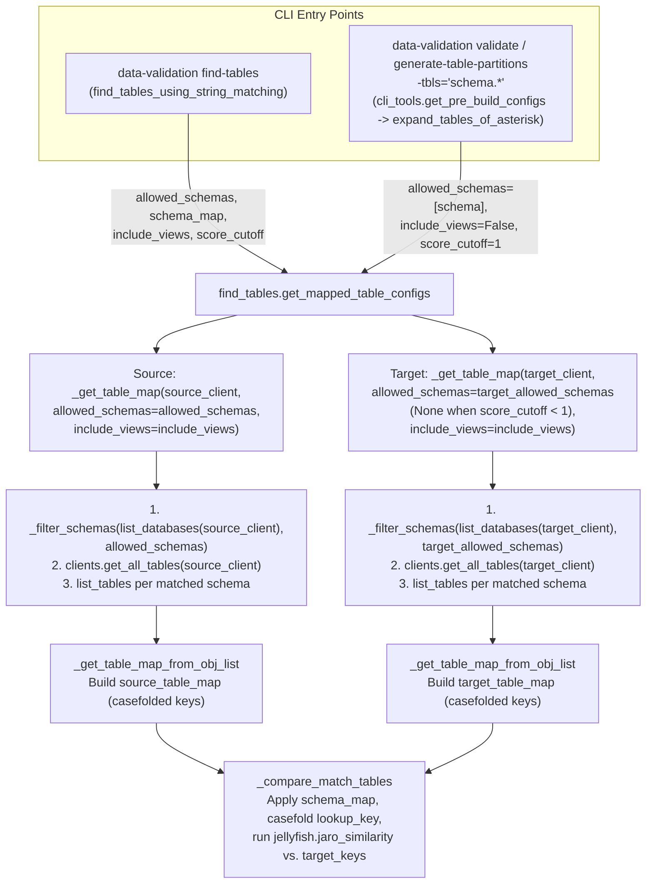

# DVT Find Tables & Wildcard Table Matching Design

This document describes how the Data Validation Tool (DVT) discovers, filters, and matches tables between source and target connections. It documents the current implementation of the `find-tables` CLI command and the `--tables-list="schema.*"` wildcard shorthand.

---

## 1. Overview & Entry Points

DVT provides two ways to automatically discover and match tables between a source and target database:

1.  **`data-validation find-tables` CLI Command**: A standalone command that discovers tables in the source and target connections, matches them using Jaro string similarity, and outputs a JSON list of table mapping dictionaries to stdout. This JSON output can be passed directly to `--tables-list` (`-tbls`) in subsequent validation commands.
2.  **`--tables-list="schema.*"` Wildcard Shorthand**: An inline shorthand supported by `validate column`, `validate row`, `validate schema`, and `generate-table-partitions`. Any `schema.*` entry in `--tables-list` is expanded in-memory using the same underlying `find_tables` matching engine before building `ConfigManager` instances.

### Entry Points & Capabilities Matrix

| Feature / Parameter | `find-tables` CLI Command | `--tables-list="schema.*"` Shorthand |
| :--- | :--- | :--- |
| **Entry Function** | `find_tables.find_tables_using_string_matching` | `find_tables.expand_tables_of_asterisk` |
| **Core Matching Function** | `find_tables.get_mapped_table_configs` | `find_tables.get_mapped_table_configs` |
| **Source Schema Filter** | Optional (`--allowed-schemas` / `-as`) | Required (derived from `schema` in `schema.*`) |
| **Cross-Schema Mapping (`src=tgt`)** | Supported via `--allowed-schemas s1=t1` | Not supported (`s1.*=t1.*` is not expanded) |
| **Include Views (`--include-views` / `-iv`)** | Configurable (defaults to `False`) | Hardcoded to `False` (Note: BigQuery `dvt_list_tables` still returns views) |
| **Score Cutoff (`--score-cutoff` / `-score`)** | Configurable `0.0` to `1.0` (defaults to `1`) | Hardcoded to `1` (exact case-insensitive match) |
| **Output Format** | JSON string printed to stdout | Python `list[dict]` replacing the `schema.*` entry |

---

## 2. Architecture & Execution Flow



### A. Argument Parsing & Input Preparation

#### 1. `find-tables` Command (`find_tables.find_tables_using_string_matching`)
*   Creates `source_client` and `target_client` from `--source-conn` (`-sc`) and `--target-conn` (`-tc`).
*   Parses `--allowed-schemas` (`-as`) via `cli_tools.get_arg_list` (which accepts either a comma-separated string or JSON list).
*   Splits any `source_schema=target_schema` entries on the first `=`:
    *   `allowed_schemas`: List of source schema names (e.g., `["s1", "s2"]`).
    *   `schema_map`: Dictionary mapping source schema names to target schema names (e.g., `{"s2": "t2"}`).
*   Defaults `score_cutoff` to `1` if `--score-cutoff` is not provided.
*   Calls `get_mapped_table_configs` and serializes the returned list to JSON.

#### 2. Wildcard Shorthand (`cli_tools.get_tables_list` & `find_tables.expand_tables_of_asterisk`)
*   `cli_tools.get_tables_list` parses `--tables-list` (`-tbls`) into a list of dictionaries. An entry like `"pso_data_validator.*"` becomes:
    ```python
    {"schema_name": "pso_data_validator", "table_name": "*"}
    ```
*   In `cli_tools.get_pre_build_configs`, if the validation is not a `Custom-query`, `find_tables.expand_tables_of_asterisk(tables_list, source_client, target_client)` is called.
*   `expand_tables_of_asterisk` iterates over `tables_list` and only expands entries that strictly match all of the following conditions:
    *   `mapping["schema_name"]` is truthy.
    *   `mapping["table_name"] == "*"` (partial wildcards like `"tab*"` are **not** expanded).
    *   Neither `target_schema_name` nor `target_table_name` is set (entries with `=`, such as `"s1.*=s2.*"` or `"s1.*=s2.t1"`, are **not** expanded).
*   For each matching `schema.*` entry, it calls:
    ```python
    get_mapped_table_configs(
        source_client,
        target_client,
        allowed_schemas=[mapping[consts.CONFIG_SCHEMA_NAME]],
        include_views=False,
    )
    ```

---

### B. Database & Table Discovery (`find_tables._get_table_map` & `clients.get_all_tables`)

`get_mapped_table_configs` wraps the table discovery and matching logic in `util.timed_call("Find tables", ...)` (which logs `DEBUG: Find tables elapsed: ...s`) and calls `_get_table_map` for both `source_client` and `target_client`:

```python
source_table_map = _get_table_map(
    source_client, allowed_schemas=allowed_schemas, include_views=include_views
)
target_allowed_schemas = None
if allowed_schemas and score_cutoff >= 1:
    target_allowed_schemas = [(schema_map or {}).get(s, s) for s in allowed_schemas]
target_table_map = _get_table_map(
    target_client,
    allowed_schemas=target_allowed_schemas,
    include_views=include_views,
)
```

`_get_table_map` resolves any schema filter via `_filter_schemas` and delegates table listing to `clients.get_all_tables(client, allowed_schemas=allowed_schemas, tables_only=(not include_views))`:

1.  **Filter by `allowed_schemas` (`find_tables._filter_schemas`)**:
    *   If `allowed_schemas` is empty or `None`, `allowed_schemas` is set to `None`, and `clients.get_all_tables` calls `clients.list_databases(client)` to scan all schemas visible to the connection.
    *   Otherwise, `_get_table_map` calls `clients.list_databases(client)` and passes the database schemas to `_filter_schemas(schemas, allowed_schemas)`.
    *   `_filter_schemas` builds a collision-safe casefolded lookup map of the database's schemas and matches each schema in `allowed_schemas` exactly (casefolded unless an exact-case key exists). There is no fuzzy matching of schema names.
    *   For `source_client`, `allowed_schemas` is always filtered this way.
    *   For `target_client`, filtering only happens when `score_cutoff >= 1`, after translating `allowed_schemas` via `schema_map` (so `--allowed-schemas src=tgt` filters the target to `tgt`). With exact matching a `schema.table` key can only match a target schema whose casefolded name equals the (mapped) source schema, so pruning is lossless.
    *   When `score_cutoff < 1`, target schemas are **not** filtered and all target schemas are scanned. Jaro similarity of the full `schema.table` key does not decompose into schema and table parts, e.g. `hr` vs `hr_dwh` scores 0.778 but `hr.employees` vs `hr_dwh.employees` scores 0.917, so no schema-level filter is safe.
    *   The resulting list of matched schema names (or `[]` if none matched) is passed to `clients.get_all_tables`, which iterates directly over `allowed_schemas` without calling `list_databases(client)` a second time.
2.  **List Tables per Schema (`clients.list_tables`)**:
    *   Selects the listing method on the Ibis backend:
        *   If `tables_only=True` and the client defines `dvt_list_tables`, uses `client.dvt_list_tables`.
            *   For SQLAlchemy backends (`postgres`, `mysql`, `oracle`, `mssql`, `db2`, `db2_zos`, `snowflake`, `sybase`, `redshift`), `BaseAlchemyBackend.dvt_list_tables` uses `self.inspector.get_table_names(schema=database)`, which excludes views (unless overridden by a custom backend).
            *   Custom backends (`oracle`, `teradata`, `mssql`, `sybase`, `spanner`, `impala`) implement `dvt_list_tables` to return only tables.
            *   Note: `ibis_bigquery.Backend.dvt_list_tables` delegates directly to `self.list_tables(like=like, database=database)`, which returns both tables and views in BigQuery even when `tables_only=True`.
        *   Otherwise (`tables_only=False` or `dvt_list_tables` not present), uses `client.list_tables`.
    *   For `redshift`, `snowflake`, and `pandas`, `fn()` is called with no `database` argument; for all other engines, `fn(database=schema_name)` is called.
    *   If `list_tables` raises an exception for a given schema (e.g., permission denied), DVT logs `WARNING: List Tables Error: {schema_name} -> {e}` and continues to the next schema.
    *   Appends `(schema_name, table_name)` tuples to `table_objs`.

---

### C. Constructing the Searchable Table Map (`_get_table_map_from_obj_list`)

`_get_table_map_from_obj_list(table_objs)` converts the list of `(schema_name, table_name)` tuples into a dictionary keyed by a normalized lookup string:

1.  **Initial Map Construction**:
    *   For each `(schema_name, table_name)` tuple, builds `table_key = ".".join([t for t in table_obj if t])` (i.e. `"{schema_name}.{table_name}"`, or `"{table_name}"` if `schema_name` is `None`/empty).
    *   Stores the original, un-casefolded identifiers in the value dictionary:
        ```python
        table_map[table_key] = {
            "schema_name": table_obj[0],
            "table_name": table_obj[1],
        }
        ```
2.  **Collision-Safe Casefolding of Keys**:
    *   Iterates over all keys where `table_key != table_key.casefold()`.
    *   If `table_key.casefold()` is **not** already in `table_map`, pops `table_key` and re-inserts it under `table_key.casefold()`.
    *   If `table_key.casefold()` **already exists** (for example, a case-sensitive engine containing both `own.tab1` and `own.TAB1`), the lowercase key is kept as `own.tab1` and the uppercase key remains `own.TAB1`.

---

### D. Table Matching & Schema Mapping (`_compare_match_tables`)

`_compare_match_tables(source_table_map, target_table_map, score_cutoff=0.8, schema_map=None)` matches each source table against `target_table_map`:

1.  **Lookup Key Construction**:
    *   `schema_map` keys come from the user and may differ in case from the real source schema names. `_resolve_schema_map` re-keys `schema_map` using the source schema names in `source_table_map`, with the same rule as `_filter_schemas`: an exact-case match is preferred, otherwise the casefolded name is used. For example `--allowed-schemas PROD_HR=DWH_HR` maps a real source schema `prod_hr`, but if the source has both `PROD_HR` and `prod_hr`, only `PROD_HR` is mapped.
    *   For each `source_key` in `source_table_map`:
        *   Retrieves `source_schema` and `source_table` from `source_table_map[source_key]`.
        *   Maps the schema if present in the resolved `schema_map`:
            ```python
            lookup_schema = schema_map.get(source_schema, source_schema)
            lookup_key = f"{lookup_schema}.{source_table}".casefold()
            ```
2.  **Jaro Similarity Search (`jellyfish_distance.extract_closest_match`)**:
    *   Calls `extract_closest_match(lookup_key, target_table_map.keys(), score_cutoff=score_cutoff)`.
    *   `extract_closest_match` iterates through **every** `target_key` in `target_table_map.keys()`, computing `jellyfish.jaro_similarity(lookup_key, target_key)`.
    *   Tracks `highest_score` (initialized to `score_cutoff`):
        ```python
        for target_key in target_list:
            score = jellyfish.jaro_similarity(search_key, target_key)
            if score >= highest_score:
                highest_score = score
                highest_value_key = target_key
        ```
        *Note: When `score_cutoff=1` (the default), only a `target_key` with `jaro_similarity == 1.0` (an exact match with the casefolded `lookup_key`) can match. Because `>=` is used, if multiple target keys tie for the highest score, the last matching key in iteration order wins.*
3.  **Output Assembly**:
    *   If a `target_key` meets the cutoff, appends a configuration dictionary preserving the original casing of both source and target identifiers:
        ```python
        {
            "schema_name": source_schema,
            "table_name": source_table,
            "target_schema_name": target_table_map[target_key]["schema_name"],
            "target_table_name": target_table_map[target_key]["table_name"],
        }
        ```

---

## 3. Current Limitations & Performance Bottlenecks

The current implementation has the following remaining behavior to be aware of:

1.  **Redundant `redshift` / `snowflake` `list_tables` Calls Across Schemas**:
    *   In `clients.list_tables`, if `client.name in ["redshift", "snowflake", "pandas"]`, `fn()` is called without `database=schema_name`, inside a loop over `schemas = list_databases(client)`. When `allowed_schemas` is not set, this calls `fn()` repeatedly for every schema in the database.
