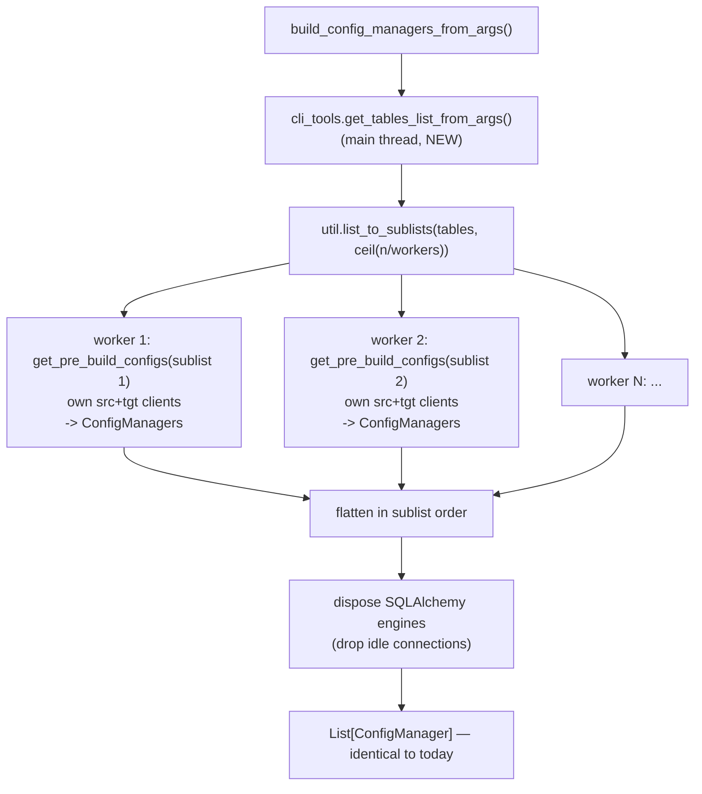

# Technical Design & Proposal: Parallel Config Manager Generation

| | |
|---|---|
| **Issue** | [#1830 — Parallelize config manager generation across tables](https://github.com/GoogleCloudPlatform/professional-services-data-validator/issues/1830) |
| **Status** | Approved, not yet implemented |
| **Last updated** | 2026-09-21 |

## Executive Summary

When generating validation configs for multiple tables (`--tables-list`, or a `schema.*`
wildcard), DVT builds `ConfigManager` objects one table at a time. Each table costs several
network round trips to both the source and target — schema catalogs, column types, primary key
detection — so build time scales linearly with table count while the process sits idle on CPU.
A 25-table schema takes ~9.3s against local databases.

**Approach (approved):** extract the `tables_list` construction, split it into N contiguous
sublists, and give each sublist its own thread.


The key realisation that keeps this small:
[get_pre_build_configs](../../../data_validation/cli_tools.py#L1656-L1659) **already creates its own source and
target clients**. If each thread calls it once with its own sublist, every thread gets its
own client pair for free — no client pool, no thread-locals, no lifetime plumbing.



### Decisions taken

| Question | Decision |
|---|---|
| Flag name | `--metadata-threads` / `-mt` |
| Load balancing | Accept static balancing via contiguous blocks |
| Clients in `get_tables_list_from_args` | Wildcard-only creation, as sketched |
| Worker cap / warning | None — leave it to the user |

---

## 1. The three changes

### 1.1 `cli_tools.get_tables_list_from_args()` — new

Lifts [L1670-L1681](../../../data_validation/cli_tools.py#L1670-L1681) and
[L1694-L1697](../../../data_validation/cli_tools.py#L1694-L1697) out of `get_pre_build_configs`:

```python
_VALIDATE_CMD_TO_CONFIG_TYPE = {
    "schema": consts.SCHEMA_VALIDATION,
    "column": consts.COLUMN_VALIDATION,
    "row": consts.ROW_VALIDATION,
    "custom-query": consts.CUSTOM_QUERY,
}


def _get_config_type(args, validate_cmd: str = None) -> str:
    """Shared by get_tables_list_from_args() and get_pre_build_configs().

    Replaces the L1622-L1634 if/elif chain. Matching is case-insensitive on both
    inputs, removing the asymmetry where args.validate_cmd was capitalised but an
    explicitly passed validate_cmd was not.
    """
    cmd = validate_cmd or getattr(args, "validate_cmd", None)
    try:
        return _VALIDATE_CMD_TO_CONFIG_TYPE[str(cmd).casefold()]
    except KeyError:
        raise ValueError(f"Unknown Validation Type: {cmd}") from None


def get_tables_list_from_args(args: "Namespace", validate_cmd: str = None) -> List[dict]:
    """Return the list of table dicts to validate, with any "schema.*" entries expanded."""
    config_type = _get_config_type(args, validate_cmd)

    mgr = state_manager.StateManager()
    source_conn = mgr.get_connection_config(args.source_conn)
    is_filesystem = source_conn[consts.SOURCE_TYPE] == consts.SOURCE_TYPE_FILESYSTEM

    if config_type == consts.CUSTOM_QUERY:
        return get_tables_list(None, default_value=[{}], is_filesystem=is_filesystem)

    tables_list = get_tables_list(args.tables_list, default_value=[{}],
                                  is_filesystem=is_filesystem)

    if any(_ and _.get(consts.CONFIG_TABLE_NAME) == "*" for _ in tables_list):
        # Only pay for a connection pair when there is actually a wildcard to expand.
        target_conn = mgr.get_connection_config(args.target_conn)
        with clients.get_data_client_ctx(source_conn) as source_client, \
             clients.get_data_client_ctx(target_conn) as target_client:
            tables_list = find_tables.expand_tables_of_asterisk(
                tables_list, source_client, target_client
            )
    return tables_list
```

Two small wins hidden in here:

- `is_filesystem` no longer needs a live client — `client._source_type` is just
  `connection_config[consts.SOURCE_TYPE]`, so we read it from the config. *(Verify
  `consts.SOURCE_TYPE_FILESYSTEM == "FileSystem"` to match the current literal at L1671.)*
- The clients for wildcard expansion are short-lived and closed via `get_data_client_ctx` —
  **but only once the defect in §3.1 is fixed**; today that context manager is a no-op for
  every backend DVT cares about. The `any(... == "*")` guard is deliberately **broader** than
  the condition inside `expand_tables_of_asterisk`, so it can only ever cause an unnecessary
  connection, never a missed expansion.
- `_get_config_type` matching is now case-insensitive, so `"row"` and `consts.ROW_VALIDATION`
  behave identically.

> [!NOTE]
> Raised in external review: `get_pre_build_configs` capitalises `args.validate_cmd` but *not* an
> explicitly passed `validate_cmd`, so `build_config_managers_from_args(args, "column")` would
> raise `ValueError: Unknown Validation Type: column`.
>
> **The reported failure is not reachable today.** Every production caller passes either `None`
> or a constant that is already correctly cased — `consts.ROW_VALIDATION` (`"Row"`) and
> `consts.CUSTOM_QUERY` (`"Custom-query"`). The only lowercase `"column"` callers are
> [three unit tests](../../../tests/unit/test__main.py#L704-L753), and those mock
> `cli_tools.get_pre_build_configs`, so the mapping is never executed.
>
> **It is still worth fixing**, for two reasons. The asymmetry is a trap, and this refactor makes
> `_get_config_type` a shared helper called from two places — including one that runs *before*
> the seam those tests mock — so the latent inconsistency becomes easier to trip over. Lowercase
> command strings also already circulate in this codebase (`args.custom_query_type` is set to
> `"row"` in `partition_and_store_config_files`).
>
> Two parts of the suggested fix were **not** adopted:
> - `(validate_cmd or getattr(args, "validate_cmd", "")).capitalize()` does not actually prevent
>   the `AttributeError` it claims to. The `""` default only applies when the attribute is
>   *absent*; argparse's `add_subparsers(dest="validate_cmd")` leaves it *present and `None`* when
>   no subcommand is given, so this still evaluates `None.capitalize()`. The dict lookup avoids
>   this by construction (`str(None).casefold()` misses the map and raises the intended
>   `ValueError`).
> - Accepting `"Custom_query"` as an alias was dropped. `consts.CUSTOM_QUERY` is `"Custom-query"`
>   and nothing in the codebase produces the underscore spelling; adding it widens the accepted
>   contract for a form that does not exist.

### 1.2 `cli_tools.get_pre_build_configs()` — one optional parameter

```python
def get_pre_build_configs(
    args, validate_cmd, tables_list: List[dict] = None
) -> List[Dict]:
    """...

    tables_list: Optional pre-computed list of table dicts. Must already be
    asterisk-expanded (see get_tables_list_from_args). When None it is derived here.
    """
    ...
    config_type = _get_config_type(args, validate_cmd)
    ...
    query_str = (
        get_query_from_query_args(args.source_query, args.source_query_file)
        if config_type == consts.CUSTOM_QUERY else None
    )
    if tables_list is None:                                   # unchanged behaviour
        tables_list = get_tables_list_from_args(args, validate_cmd)

    pre_build_configs_list = []                               # L1693, unchanged
    # DELETED — L1694-1697, the expand_tables_of_asterisk() call, now lives solely
    # in get_tables_list_from_args().
    for table_obj in tables_list:                             # L1698, unchanged
        ...                                                   # body unchanged to L1766
```

Everything else in the function — including the two `clients.get_data_client()` calls at
L1656-1659 — stays exactly where it is. **That is the whole trick: those two lines now run
once per worker thread, so each thread's clients are used only by that thread.**

> [!NOTE]
> Raised in external review: an earlier draft said "everything from L1693 onwards is untouched",
> which contradicted §1.1. To be unambiguous — **L1694-1697 is deleted**; L1693 and L1698
> onwards are untouched. Leaving the expansion in place would be functionally harmless (after
> expansion no entry has `table_name == "*"`, so the call is a pass-through with no client
> access) but it would be dead code re-scanning every sublist, and two places could disagree
> about where expansion happens.
>
> The trade-off is a new precondition: `get_pre_build_configs` no longer expands wildcards for a
> caller-supplied `tables_list`. That is intentional — `get_tables_list_from_args` becomes the
> single owner of expansion — but it must be stated in the docstring, as above.

### 1.3 `__main__.build_config_managers_from_args()` — the orchestration

The existing loop body moves verbatim into a helper; the only new code is the chunking:

```python
def _build_config_managers_for_tables(args, validate_cmd, tables_list) -> List[ConfigManager]:
    """Build ConfigManagers for a sublist of tables. Runs on one thread with its own clients."""
    configs = []
    for pre_build_configs in cli_tools.get_pre_build_configs(
        args, validate_cmd, tables_list=tables_list
    ):
        try:
            config_manager = ConfigManager.build_config_manager(**pre_build_configs)
            config_manager = build_config_from_args(args, config_manager)
        except Exception as e:
            ...                       # unchanged BuildConfigException wrapping
        configs.append(config_manager)
    return configs


def build_config_managers_from_args(args, validate_cmd: str = None) -> List[ConfigManager]:
    def _build_configs():
        tables_list = cli_tools.get_tables_list_from_args(args, validate_cmd)
        workers = _resolve_metadata_threads(args, tables_list)

        if workers == 1:
            return _build_config_managers_for_tables(args, validate_cmd, tables_list)

        sublists = util.list_to_sublists(tables_list, math.ceil(len(tables_list) / workers))
        logging.debug("Building configs for %d tables across %d threads",
                      len(tables_list), len(sublists))
        task = functools.partial(_build_config_managers_for_tables, args, validate_cmd)
        with ThreadPoolExecutor(max_workers=len(sublists),
                                thread_name_prefix="dvt-metadata") as executor:
            nested = list(executor.map(task, sublists))

        config_managers = [cm for sublist in nested for cm in sublist]
        _release_idle_connections(config_managers)     # see section 3
        return config_managers

    return util.timed_call("Build config", _build_configs)
```

`_resolve_metadata_threads(args, tables_list)` returns
`min(getattr(args, "metadata_threads", consts.DEFAULT_METADATA_THREADS), len(tables_list))`,
floored at 1, and forced to 1 for a FileSystem source (§4).

---

## 2. Why contiguous blocks, and what it costs

`util.list_to_sublists` already produces **contiguous** chunks, so concatenating the workers'
results in sublist order reproduces today's ordering exactly. That matters, because list order
is directly user-visible in every consumer:
[run_validations L583-L584](../../../data_validation/__main__.py#L583-L584) (execution and reporting order),
[store_yaml_config_file L593](../../../data_validation/__main__.py#L593) /
[store_json_config_file L604](../../../data_validation/__main__.py#L604) (order of validations within the
single output file), and [store_config_dir L630-L646](../../../data_validation/__main__.py#L630-L646)
(filenames and `_1`/`_2` collision suffixes).

Round-robin striping (`tables[k::N]`) would balance better. **Rejected**, because a worker
returns **one flat list with the table boundaries erased**, and the mapping from table to
config is *not* 1:1:

> [!IMPORTANT]
> **One table can produce M ≥ 1 configs.** For `--hash` / `--concat` row validations,
> [_concat_column_count_configs L1555-L1574](../../../data_validation/cli_tools.py#L1555-L1574) splits a
> wide table into one config per chunk of `_max_concat_columns` columns, and
> [L1762](../../../data_validation/cli_tools.py#L1762) `extend`s them into the flat result
> ([issue #1216](https://github.com/GoogleCloudPlatform/professional-services-data-validator/issues/1216)).
> M is data-dependent — it varies with column count, `--exclude-columns`, and the
> source/target engine pair. So you cannot recover the original table order by index
> arithmetic on the flattened output; you would have to change the return contract to group
> configs per table. Contiguous chunking side-steps this entirely and stays deterministic.

> [!NOTE]
> An earlier draft claimed striping would change config *filenames*. That was overstated.
> `seen_names` in `store_config_dir` is keyed on `schema.table`, and the M configs for one
> table stay adjacent and in column-chunk order within a single worker's output, so the
> `_1`/`_2` suffixes would in fact survive striping — except where two distinct `tables-list`
> entries share a source table name. The genuine exposure is the *relative order of different
> tables* in the single-file YAML/JSON output and in execution/reporting.

Accepted trade-off: **static load balancing**. Clients are tied to sublists, not to tables, so
a chunk containing several wide tables finishes late and the win is capped by the slowest
chunk. If skew ever matters, the upgrade path is per-table tasks plus a thread-local client
pool — a bigger change, not worth it up front.

---

## 3. Idle connections between build and run — analysis and mitigation

**The concern:** with 20 tables and 2 workers, the pair created by worker 2 is used during the
build, then sits idle while validations 1-10 run serially on the main thread. A firewall idle
timeout or a database profile (`IDLE_TIME`) could kill it in the meantime. This is a **new**
exposure: today's single pair is exercised by every validation in turn, so it never idles.

**Most of it is already covered.** Every DVT-forked SQLAlchemy backend sets
`pool_pre_ping=True`:

| Backend | Pool | `pool_pre_ping` | Idle exposure |
|---|---|---|---|
| oracle, postgres, db2, db2_zos, redshift | `StaticPool` | Yes | Protected — ping on checkout, transparent reconnect |
| mssql, sybase | `NullPool` | Yes | Immune — connection per checkout, nothing idles |
| **mysql, snowflake** | `StaticPool` (upstream ibis 7.1 `do_connect`) | **No** | **Exposed** |

Verified rather than assumed:

- `_ConnectionFairy._checkout` tests `pool._pre_ping` independently of pool class
  (`sqlalchemy/pool/base.py:1302`); a failed ping raises `InvalidatePoolError`.
- `StaticPool._do_get` discards a hard/soft-invalidated record and builds a new one
  (`sqlalchemy/pool/impl.py:515-521`), and the checkout loop retries (`attempts = 2`).

Remaining gaps:

1. **MySQL and Snowflake** — no pre-ping. Exposed today too, just far less often.
2. **Non-SQLAlchemy clients** (BigQuery, Impala, Teradata, Spanner) have no ping or
   auto-reconnect, but [run_validation](../../../data_validation/__main__.py#L526-L535) only passes cached
   clients for SQLAlchemy backends, so the only post-build reuse is `PartitionBuilder`, which
   runs immediately after the build. Short window, low risk.
3. `StaticPool`'s docstring warns that invalidation is *"only partially supported... may not
   yield good results"*. The code path above does work, but is not something to lean on
   exclusively.

### 3.1 Prerequisite defect: `get_data_client_ctx` does not close anything

Raised in external review and **confirmed**.
[get_data_client_ctx](../../../data_validation/clients.py#L440-L455) guards its cleanup with
`hasattr(client, "close")`, but almost no DVT backend has a `close()` method:

| Backend | `close()` in Ibis 7.1 |
|---|---|
| Impala (upstream), Teradata (DVT fork) | Yes |
| Oracle, Postgres, MySQL, MSSQL, DB2, DB2 z/OS, Redshift, Snowflake, Sybase, BigQuery, Spanner, FileSystem | **No** |

Verified by attribute inspection of each backend class, not by reading:
`BaseBackend` and `BaseAlchemyBackend` define neither `close` nor `disconnect`.

**This is not a regression from the Ibis 5 → 7 upgrade.** The set of upstream backends with a
`close()` method is *identical* in 5.1.0 and 7.1.0 — clickhouse, impala, pyspark — and DVT uses
only one of them. The `hasattr` guard has never covered a SQLAlchemy backend. Consequently the
TODO at [clients.py L448-L449](../../../data_validation/clients.py#L448-L449) is misleading: the
try/except was never about SQLAlchemy, and after the Ibis 9 upgrade `disconnect()` becomes
universal on `BaseBackend`, so the guard needs rewriting rather than deleting.

**Current blast radius is negligible**, which is presumably why it went unnoticed. Both callers
— [raw_query.py L28](../../../data_validation/raw_query.py#L28) (`data-validation query`) and
[__main__.py L716](../../../data_validation/__main__.py#L716) (`connections add`) — exit the
process moments later. Worth re-testing whether
[#1376](https://github.com/GoogleCloudPlatform/professional-services-data-validator/issues/1376)
was genuinely resolved by PR #1381, since that fix is a no-op for Oracle and PostgreSQL.

It becomes **material for this change**: §1.1 creates a client pair early in a process that
then runs for the entire validation, so leaking it is a real idle connection for the whole run.
Fix it first, as its own commit, so it can be reviewed and reverted independently.

### 3.2 Mitigation: release idle connections at the end of the build

```python
# clients.py — one place to change when Ibis drops SQLAlchemy (see section 8)
def release_connection(client) -> None:
    """Release a client's physical connection without invalidating the client itself.

    The client stays usable and reconnects transparently on next use.
    """
    if not is_sqlalchemy_backend(client):
        return          # close() on non-SQLAlchemy clients is terminal, leave them alone
    try:
        client.con.dispose()
    except Exception as exc:
        logging.warning("Exception releasing connection: %s", str(exc))


def close_data_client(client) -> None:
    """Terminally release a client's resources: dispose the engine pool (SQLAlchemy
    backends) and call close() where the backend provides one (Impala, Teradata)."""
    if client is None:
        return
    release_connection(client)
    if hasattr(client, "close"):
        try:
            client.close()
        except Exception as exc:
            logging.warning("Exception closing connection: %s", str(exc))


@contextmanager
def get_data_client_ctx(*args, **kwargs):
    """Provide get_data_client() via a context manager."""
    client = None
    try:
        client = get_data_client(*args, **kwargs)
        yield client
    finally:
        close_data_client(client)       # was: only close() if the backend had one


# __main__.py
def _release_idle_connections(config_managers: List[ConfigManager]) -> None:
    """Release connections used for config build so none sit idle through the
    validation phase."""
    seen = set()
    for cm in config_managers:
        for client in (cm.source_client, cm.target_client):
            if id(client) not in seen:
                seen.add(id(client))
                clients.release_connection(client)
```

- `Engine.dispose()` closes the pooled connection; the engine stays usable and reconnects on
  next checkout (`StaticPool.dispose()` closes and un-memoizes the record, `impl.py:477-483`).
- Zero idle sockets between build and run; connection count during the long validation phase
  returns to today's level.
- Covers MySQL and Snowflake, which pre-ping does not.
- Already an established DVT pattern —
  [close_client_connections](../../../data_validation/config_manager.py#L143-L157) does `con.dispose()`.
- **Only SQLAlchemy clients.** `close()` on the others is terminal and `PartitionBuilder`
  still needs them.
- Called only when `workers > 1`, so the serial path stays byte-identical.
- Cost: at most `workers` lazy reconnects.

> [!IMPORTANT]
> Keep the dispose behind the `clients.release_connection()` shim rather than calling
> `client.con.dispose()` from `__main__`. `con` is a SQLAlchemy `Engine` **only until the Ibis
> upgrade** — from Ibis 9.0 onwards `con` is a raw DBAPI connection and the equivalent becomes
> `client.disconnect()` now plus `client.reconnect()` before next use (§8).

> [!NOTE]
> `StaticPool` is *"a pool of exactly one connection, used for all requests"* — it neither
> isolates per thread nor prevents concurrent checkout of the same DBAPI connection. Sharing a
> single client across worker threads would hand the same socket to two threads running
> statements concurrently. **Per-thread clients are a correctness requirement here, not an
> optimisation.**

---

## 4. Other risks and details

> [!WARNING]
> **`StateManager.setup()` has a TOCTOU race.**
> [state_manager.py L134-L139](../../../data_validation/state_manager.py#L134-L139) does
> `if not os.path.exists(dir): os.makedirs(dir)`, and a `StateManager` is constructed in
> `get_pre_build_configs` **and** in every `ConfigManager.__init__`. Two threads can race into
> `FileExistsError`. Fix with `os.makedirs(..., exist_ok=True)` before adding threads.

1. **`args` is mutated inside the worker — make it a local instead.**
   [L1637](../../../data_validation/cli_tools.py#L1637) does
   `args.result_handler = args.result_handler or args.bq_result_handler` — every thread writes
   the same value to shared state. Benign in practice (idempotent, same value), but there is no
   reason to keep it: nothing outside `get_pre_build_configs` ever reads `args.result_handler`
   or `args.bq_result_handler`, so the assignment can simply become a local variable and the
   mutation disappears rather than being relocated:

   ```python
   # Cater for legacy -bqrh.
   result_handler_arg = args.result_handler or args.bq_result_handler
   result_handler_config = (
       _get_result_handler(result_handler_arg, args.service_account)
       if result_handler_arg
       else None
   )
   ```

   > [!NOTE]
   > Plain attribute access, not `getattr`. `--result-handler`, `--bq-result-handler` and
   > `--service-account` are added unconditionally by
   > [_add_common_arguments L1096-L1116](../../../data_validation/cli_tools.py#L1096-L1116), so they are
   > always present on a real `args` and default to `None`. Contrast with `use_random_row`,
   > `CONFIG_FILTERS` and `CONFIG_THRESHOLD` just below, which are genuinely defined by only
   > *some* subparsers and so correctly use `getattr`. See §6 for why we do not add
   > defensiveness purely to accommodate bare-`Namespace` tests.

   With this change `args` is provably read-only for the duration of the threaded region: the
   only other `args` mutations in `data_validation/` are
   [__main__.py L410-L411](../../../data_validation/__main__.py#L410-L411) and
   [__main__.py L674](../../../data_validation/__main__.py#L674), all of which run single-threaded
   before the pool is created.
2. **Do not try to consolidate clients afterwards.** `ConfigManager` caches
   `_source_ibis_table` / `_target_ibis_table`
   ([L420-L464](../../../data_validation/config_manager.py#L420-L464)) bound to the creating backend, so
   swapping a `ConfigManager` onto a different client would need those caches invalidated and
   the tables re-introspected. (Disposing the engine, as in §3, does **not** have this problem
   — the backend object is unchanged.)
3. **Connection accounting.** `2 × workers` sessions during the build (today: 2), plus a
   transient pair in the main thread when a wildcard is expanded, dropping back to ~0 idle
   after `_release_idle_connections`. No cap or warning — user's call.
4. **FileSystem (pandas) source.** `get_pandas_client` loads the file into memory, so N workers
   means N copies and there is no I/O to overlap. Force `workers = 1`.
5. **Custom query** yields `tables_list == [{}]`, so `min(flag, 1) == 1` — serial, no change.
6. **Repeated per-thread setup.** Each worker redoes the cheap table-independent work in
   `get_pre_build_configs` (labels, filters, `_get_result_handler`). `_get_result_handler`
   calls `mgr.list_connections()`, a directory/GCS list per thread — negligible, but N× now.
7. **Error semantics.** `executor.map` preserves order and re-raises the first exception in
   sublist order when results are consumed, so `BuildConfigException` messages and `__cause__`
   stay deterministic and unchanged. Siblings finish rather than being cancelled; acceptable
   for metadata queries.
8. **Log interleaving.** `"Splitting validation into N queries for X"` messages will
   interleave; they already name the table, so this is cosmetic.

---

## 5. CLI flag

Add to [_add_common_arguments](../../../data_validation/cli_tools.py#L1085-L1157) so every `validate *` subcommand and
`generate-table-partitions` inherits it:

```python
optional_arguments.add_argument(
    "--metadata-threads", "-mt",
    type=_check_positive,
    default=consts.DEFAULT_METADATA_THREADS,   # 2
    help="Number of threads used to read source/target metadata when generating validation "
         "configs for multiple tables (default 2). Each thread opens its own source and "
         "target connection.",
)
```

- `-mt` is free (checked against all existing short flags).
- Read with `getattr(args, "metadata_threads", consts.DEFAULT_METADATA_THREADS)` — `args` is a
  bare `Namespace` in several tests and in the deploy/Flask path.
- The help text must say *metadata for config generation*, since DVT already uses "metadata"
  internally for `RunMetadata` (validation results).

---

## 6. Test plan

**Existing tests** — the additive signature means
[test__main.py L704-L753](../../../tests/unit/test__main.py#L704-L753) should still pass, but they call
`build_config_managers_from_args(argparse.Namespace(), "column")`, which will now first call
`get_tables_list_from_args` → real `StateManager` + `args.source_conn`. Fix: add
`@mock.patch("data_validation.cli_tools.get_tables_list_from_args")` returning `[{...}]` to
those three tests.

> [!NOTE]
> Raised in external review: make `get_tables_list_from_args` tolerate a missing `source_conn`
> via `getattr(args, "source_conn", None)` and skip the connection work, so the three tests need
> no new mock. **Not adopted.**
>
> - **The branch is unreachable in production.** `--source-conn` and `--target-conn` are
>   `required=True` in [_add_common_arguments](../../../data_validation/cli_tools.py#L1089-L1094),
>   and the only production construction of `args` is `cli_tools.get_parsed_args()`. The Flask
>   deploy path in [app.py](../../../data_validation/app.py) never reaches this code — it calls
>   `DataValidation(config)` directly. The fallbacks would be dead code outside tests.
> - **It turns a loud failure into a silent wrong answer.** With `source_conn` absent,
>   `is_filesystem` silently becomes `False`, so a FileSystem connection would fail with a
>   misleading "schema required" parse error; and wildcard expansion is skipped, so
>   `-tbls=schema.*` would pass a *literal* table named `*` downstream and fail much later, far
>   from the cause. An immediate `AttributeError` is the better outcome.
> - **It is internally inconsistent**: `source_conn` and `tables_list` are guarded, but
>   `args.target_conn` is still accessed directly, and `mgr` is only bound inside the earlier
>   `if`. Both are safe only via a non-obvious invariant, which shows the shape is driven by one
>   specific test rather than by a contract.
> - **Cost is lopsided**: ~8 lines of permanent production branching versus one decorator line in
>   three tests whose sole purpose is asserting `BuildConfigException` wrapping.
>
> The underlying observation is fair, though — this change does make
> `build_config_managers_from_args` do real work before reaching the seam those tests mock. The
> right remedy is at the test boundary. Worth adding a shared helper that builds a *realistic*
> args `Namespace` (`source_conn`, `target_conn`, `tables_list`, `metadata_threads`) so future
> unit tests stop depending on exactly which attributes the implementation happens to touch.

> [!TIP]
> Implementation detail this review surfaced: `_resolve_metadata_threads` needs `is_filesystem`
> to force `workers = 1`, and so does `get_tables_list_from_args`. Decide one owner rather than
> reading the connection config twice — either have `get_tables_list_from_args` return
> `(tables_list, is_filesystem)`, or resolve the source connection dict once in
> `build_config_managers_from_args` and pass it down. The second `StateManager` read is cheap
> locally but is a GCS round trip when `PSO_DV_CONFIG_HOME` points at a bucket.

**New unit tests**

| Test | Assertion |
|---|---|
| Order preservation | 10 fake tables, workers 1/2/3/4 → output order identical to serial |
| Sublist chunking | `_resolve_metadata_threads` + `list_to_sublists` produce ≤ workers contiguous chunks covering every table exactly once |
| One client pair per thread | Patch `clients.get_data_client` to record `threading.get_ident()`; assert pairs created == number of sublists and no pair spans two threads |
| Exception propagation | Failure on a table in sublist 2 of 3 still raises `BuildConfigException` with the right table name and `__cause__` |
| Clamping | `workers = min(flag, len(tables))`; forced to 1 for FileSystem; `-mt 0` rejected by `_check_positive`; default 2 |
| `get_tables_list_from_args` | Wildcard case calls `expand_tables_of_asterisk` and closes its clients; non-wildcard case creates **no** clients; custom-query returns `[{}]` |
| `_release_idle_connections` | `con.dispose()` called exactly once per distinct SQLAlchemy client; never called for non-SQLAlchemy clients; not called when `workers == 1`; a raising `dispose()` is logged, not propagated |

**Manual verification** — re-run your benchmark and diff the output:

```bash
data-validation -ll DEBUG validate column -sc ora -tc pg -tbls="pso_data_validator.*" \
  --config-dir /tmp/cfg_serial   -mt 1
data-validation -ll DEBUG validate column -sc ora -tc pg -tbls="pso_data_validator.*" \
  --config-dir /tmp/cfg_parallel -mt 4
diff -r /tmp/cfg_serial /tmp/cfg_parallel    # must be empty
```

Also worth doing:

- A **multi-table validation run** (not just config generation) with `-mt 4` against Oracle,
  to confirm the reconnect after `dispose()` works in the wild for the later sublists.
- `generate-table-partitions` with `-mt > 1`, since that path keeps using the worker-created
  clients after the build.

---

## 7. Sequencing

1. `os.makedirs(..., exist_ok=True)` in `StateManager.setup()`.
2. **Fix `get_data_client_ctx` (§3.1)** — add `clients.release_connection()` and
   `clients.close_data_client()`, and make the context manager call the latter. Standalone
   commit: it changes shared behaviour for `data-validation query` and `connections add`, so it
   should be reviewable and revertable on its own. Add a unit test asserting `con.dispose()` is
   called for a SQLAlchemy client and `close()` for an Impala/Teradata-style one.
3. Extract `_get_config_type()` + `get_tables_list_from_args()`; add the `tables_list=None`
   parameter to `get_pre_build_configs()`. Replace the `args.result_handler` assignment with a
   local (§4 item 1). **Still fully serial — full test suite must be green here.**
4. Extract `_build_config_managers_for_tables()` in `__main__`, still called once with the
   full list. Again no behaviour change.
5. Add `consts.DEFAULT_METADATA_THREADS`, the `--metadata-threads` flag and
   `_resolve_metadata_threads()`.
6. Add the `ThreadPoolExecutor` branch (the `workers == 1` path bypasses the executor
   entirely, so serial behaviour stays byte-identical).
7. Add `_release_idle_connections()` and call it when `workers > 1`.
8. Fix up the three mocking unit tests, add the new tests, run `black` + `flake8`.
9. Docs: flag reference in `README.md` / `docs/`, plus a note about connection counts.

---

## 8. Connection resilience after the Ibis upgrade (separate issue)

Two pre-existing robustness gaps surfaced while analysing §3. Neither blocks this change, but
both get worse the more we rely on long-lived clients.

**8.1 MySQL and Snowflake have no pre-ping today.** They go through upstream ibis 7.1
`do_connect` with `StaticPool` and no `pool_pre_ping`, unlike all seven DVT-forked backends.

**8.2 Ibis 9.0+ removes the pre-ping safety net entirely.** Ibis 9.0 "completes the transition
from SQLAlchemy to SQLGlot", and there is no equivalent feature. Verified against the
`ibis-framework` 12.0.0 wheel:

| Check | Result |
|---|---|
| `grep -rln sqlalchemy ibis/` | Only `ibis/examples/pixi.lock` — gone from the runtime |
| `grep -rn "pre_ping\|pool_recycle\|poolclass" ibis/` | **Zero hits** — no connection pool exists, so there is nothing to pre-ping |
| Connection storage | One raw DBAPI connection per backend: `psycopg.connect` (postgres:237), `oracledb.connect` (oracle:193), `MySQLdb.connect` (mysql:129), `pyodbc.connect` (mssql:192), `sc.connect` (snowflake:264) |
| Health checks | Only Impala's `cur.ping()` (impala:176), a one-off smoke test **at connect time** |
| Retry on disconnect during execution | None (only Athena catches `OperationalError`, for error translation) |

The replacement is manual: `BaseBackend.reconnect()` (`ibis/backends/__init__.py:1064`)
re-runs `do_connect(*self._con_args, **self._con_kwargs)`, guarded by `_can_reconnect` (set
`False` only for `from_connection(...)`, which DVT does not use). `disconnect()` is the
explicit close. Usefully, `reconnect()` swaps `con` on the *same backend object*, and Ibis
expressions hold the backend rather than the connection — so it is transparent to a
`ConfigManager`'s cached `_source_ibis_table`, exactly as `engine.dispose()` is today.

Implications to record against the Ibis upgrade work (see the TODO at
[clients.py L448-L449](../../../data_validation/clients.py#L448-L449)):

- After the upgrade, a sniped idle session becomes a hard mid-validation error on **every**
  backend. Long row validations against Oracle are exactly the workload that hits this.
- DVT will need its own strategy: a ping-and-`reconnect()` wrapper around execution, and/or
  driver-level keepalives — `oracledb.create_pool(..., ping_interval=...)`, Snowflake
  `client_session_keep_alive=True`, psycopg TCP `keepalives`.
- `clients.release_connection()` (§3) is the natural place to absorb the change: `con.dispose()`
  becomes `client.disconnect()` plus a `reconnect()` on next use.

---

## 9. Repeated Cloud Storage lookups in `StateManager` (separate issue)

Raised in review. **Real, but pre-existing and orthogonal — tracked separately, not in scope
here.**

When `PSO_DV_CONN_HOME=gs://...`,
[get_connection_config L72-L83](../../../data_validation/state_manager.py#L72-L83) has no cache, so every
call is a Cloud Storage round trip. This change takes the count from ~4 to ~`2N + 4`.

Reasons to split it out:

- **It is not a regression.** At the default `-mt 2` that is 8 reads instead of 4, and the
  extra reads happen *concurrently*, one per worker — wall-clock cost is roughly unchanged.
- **The sequential path benefits just as much**, so the fix should not be gated on this issue.
- **The recommended fix does not work as written.** A per-instance `self._conn_cache` has a
  hit rate of *zero* for the dominant caller, because
  [config_manager.py L54](../../../data_validation/config_manager.py#L54) constructs a **brand new
  `StateManager` per `ConfigManager`**, i.e. per table. Fixing it properly needs a
  class-level or module-level cache.
- **A shared cache needs a staleness decision.** Under `data-validation deploy` (Flask) the
  process is long-lived and a user may edit a connection between requests, so a process-wide
  cache needs a TTL or invalidation hooks in `create_connection` / `delete_connection`. That
  is a design discussion, not a one-liner. (Thread-safety itself is a non-issue: a duplicate
  read is harmless and dict get/set is atomic under the GIL.)

> [!NOTE]
> **The bigger win is one level down.**
> [get_gcs_bucket L37-L45](../../../data_validation/gcs_helper.py#L37-L45) constructs a **new
> `storage.Client()` on every single call** — including from
> [StateManager.setup_gcs](../../../data_validation/state_manager.py#L141-L147), which runs from
> `StateManager.__init__`. So a 25-table run already builds ~25+ storage clients (each doing
> credential resolution) *before* counting any blob downloads. Caching the `storage.Client`
> (or the `Bucket`) would help every GCS code path — connection reads, config writes, result
> handlers — rather than just `get_connection_config`. Whoever picks up the issue should scope
> it there.

Suggested issue title: *"Cache Cloud Storage client and connection configs in `StateManager` /
`gcs_helper`"*.


